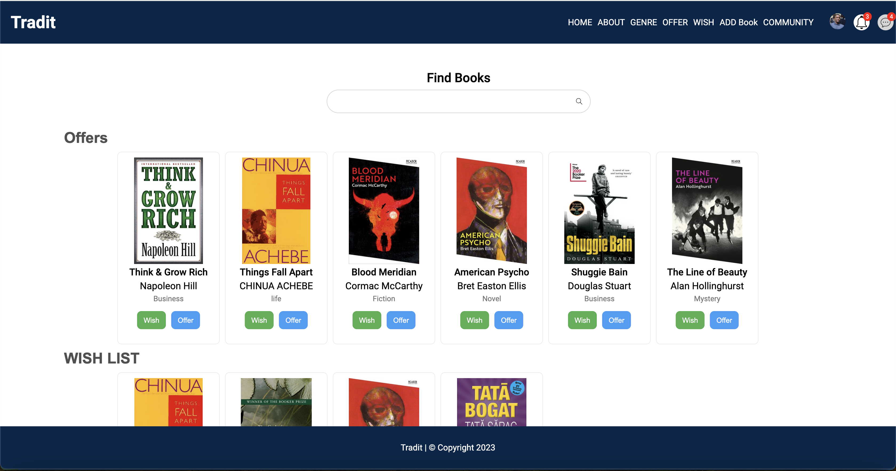
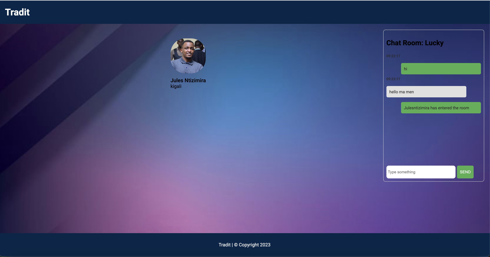
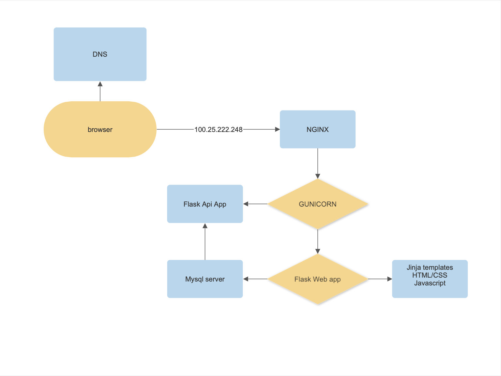

# Tradit - Empowering Book Enthusiasts through Shared Reading

## Introduction

### The Project

Tradit addresses the common scenario where individuals accumulate books they no longer need. This platform offers a space to exchange or give away books, fostering connections among individuals with shared literary interests.

### The Context

This project serves as my Portfolio Project, marking the conclusion of my Foundation at ALX - Holberton School. Despite the option to work in a team, I chose to work solo due to availability constraints. I aimed to create a seamless experience for book enthusiasts while showcasing my coding skills.

### The Team

I am Jules Ntizimira, a passionate coder with a unique perspective fueled by a love for literature and entrepreneurship. Follow me on [Twitter](https://twitter.com/NtizimiraJ) for more tech-related updates.

## User Stories

As a book enthusiast:
- I want to discover a platform for exchanging books
- So that I can exchange my read books for new ones without incurring additional costs

**Acceptance Criteria:**
- Users can create a profile
- Browse diverse books
- Search for specific books by title, author, or genre
- View detailed book information and user reviews
- Propose book exchanges and receive notifications
- Access a secure communication channel for finalizing exchanges

## Blog Posts

After the development phase, I wrote a reflective blog post on the Tradit journey.

Read the blog post: [Tradit: Swap Books — Share the Joy](https://medium.com/@ntizimijules5/swap-books-share-the-joy-229b658b00fb)

## Tutorial

Take a tour of the deployed version at [Tradit](https://julesntizimira.github.io/Tradit/).

Here is a little preview of our main feature, the dashboard:

Here is a preview for the chat room page:

## Known Bugs

- The app is slow due to pictures being saved on the server
- Not responsive views

## Architecture

### Overview

The web app comprises Python and MySQL on the backend, with Flask as the framework interface. HTML/CSS and JavaScript handle frontend functionalities. Nginx manages the server side, served by the Gunicorn application server. An additional app for API runs on different ports. For certain functionalities, the main app accesses the server directly, while others use the API.

### List of Components

These components define the user experience in Tradit, with each component housing code for a specific app page. Components can be located in [webdynamic/templates](./webdynamic/templates).

| Component     | Description                                      |
| ------------- | ------------------------------------------------ |
| [Index](./webdynamic/Landing.vue)   | Landing page for users on Tradit                 |
| [Login](./webdynamic/templates/login.html)   | Login page with a link to the Signup page         |
| [Community](./webdynamic/templates/users.html) | Page displaying other users                     |
| [Chat Room](./webdynamic/templates/room.html) | Secure chat room for users                       |
| [Signup](./webdynamic/templates/register.html) | Signup page requiring user information           |
| [Dashboard](./webdynamic/templates/book.html) | Main page where users explore available books    |
| [About](./webdynamic/templates/book.html) | Information page about the platform              |
| [Register Book](./webdynamic/templates/registerb.html) | Page for users to register a new book    |

## Authentication

Implementing a robust authentication system was a pivotal aspect of Tradit's development. To achieve this, I delved into learning Flask-Login, a tool that streamlined the management of user logins. Flask-Login not only facilitated a secure and seamless login experience but also provided valuable functionalities such as handling the current user. By leveraging this technology, Tradit ensures that user authentication is not just a procedural step but a feature that enhances the overall user experience.

## Socket Chat Rooms

Real-time communication is at the heart of Tradit's user interaction, and this is made possible through the implementation of socket chat rooms. These chat rooms offer users a secure and dynamic environment to engage in live conversations. When a user expresses interest in a particular book, the chat room becomes the conduit for direct communication with the owner, allowing them to finalize the details of the book exchange securely. The integration of socket chat rooms adds a layer of immediacy and interactivity, making Tradit more than just a platform for book exchange but a community where users can connect effortlessly.

# Acknowledgments

- ALX staff: For the help, advice, and resources throughout the project and curriculum.
- Cohort 13 and all ALX students: For friendship, support, and insights over the last year.
- YOU: For reading this documentation and testing out Tradit. We hope you enjoyed the ride!

# Related Projects

- [AirBnB Clone](https://github.com/Julesntizimira/AirBnB_clone_v4): A web app in Python, Flask, and JQuery.
- [Simple Shell](https://github.com/Julesntizimira/simple_shell): A command line interpreter replicating the sh program.
