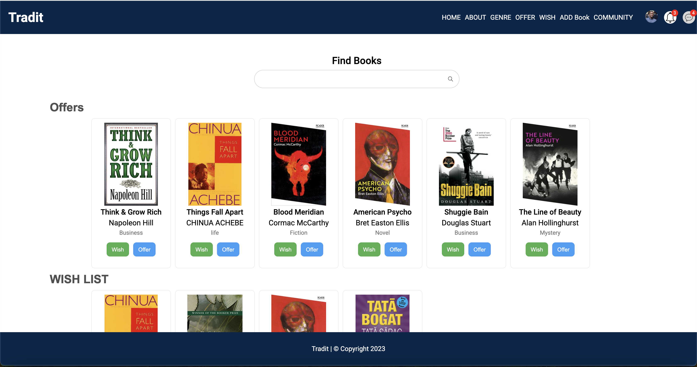

#  ~ *Swap Books - Share the fun*

# Introduction

## The Project
Tradit will address the common scenario where individuals accumulate books they no longer need. Often, after reading a book, one might prefer not to keep it unless they are building a personal library. Tradit will offer a platform to exchange, or give away these books, creating an opportunity to connect with others interested in these titles.

## The Context
This project serves as my Portfolio Project, marking the conclusion of my Foundation at ALX - Holberton School. I had the option of working either in a team or doing it solo. While I desired to undertake this project collaboratively and reap the benefits of teamwork, I ultimately chose to work alone due to my availability constraints during these days. I didn't want to be a burden to anyone.

## The Team
I am a passionate coder who enjoys bringing a creative touch to projects. Here's a bit about me:

[Jules Ntizimira](https://twitter.com/NtizimiraJ) - Book lover and entrepreneur, currently working solo on this project. I bring a unique perspective to coding, fueled by a passion for both literature and entrepreneurship.

Follow me on Twitter for more tech related awesomeness!

## User Stories

As a book enthusiast
I want to discover a platform for exchanging books
So that I can exchange my read books for new ones without incurring additional costs**

### Acceptance Criteria:
- As a user, I should be able to create a profile on the platform.
- I should be able to browse through a diverse range of available books.
- I want to search for specific books by title, author, or genre.
- Upon finding a book of interest, I should be able to view details such as book author, genre and user reviews.
- I need the option to propose a book exchange by offering one of my owned books.
- I want to be notified when someone expresses interest in one of my books for an exchange.
- Upon confirmation, I should be provided with a secure channel for communication with the other party to finalise the exchange details.

## Blog posts
After the development phase, i wrote a blog post to reflect on the tradit journey.

[tradit: Swap Books — Share the Joy](https://medium.com/@ntizimijules5/swap-books-share-the-joy-229b658b00fb)

# Tutorial

## Take a tour of the deployed version at puppr.best
-> [**PuppR**](https://puppr.best/)

Here is a little preview of our main feature, the dashboard:

Here is a simple flow for the user chatroom on PuppR:

## Known bugs
* the app is slow due to pictures are being saved on the server
* not responsive views

# Architecture

## Overview
web app consists of Python and MySQL on the backend, Flask as the framework interface, and HTML/CSS and Javascript for frontend functionalities. Nginx manage the server side and served by gunicorn application server. Beside i created another app for Api, Both apps are running on different ports. for some functionalities the main app access the server directly but for others it uses api

### List of components

These components make up what a user experiences when they check out **Tradit**. Each component contains the code for a specific page of the app. These components can be located in [webdynamic/templates](./webdynamic/templates).

| Component | Description |
|-----------|-------------|
| [index](./webdynamic/Landing.vue) | The landing page a user sees when they navigate to **Tradit**. |
| [Login](./webdynamic/templates/login.html)   | The login page. There's a link to go to the Signup page if a user hasn't signed up. |
| [Community](./webdynamic/templates/users.html) | Page where users can see the other users. |
| [chat room](./webdynamic/templates/room.html) | The chat room page where users can have a secure conversation  |
| [Signup](./webdynamic/templates/register.html) | Signup page for users who do not have an account. It asks for a name, username, email, address, and a profile photo upload |
| [dashboad](./webdynamic/templates/book.html) | The main page of **Tradit** where users can go through available books in wishlist and offer list. you can even search  |
| [about](./webdynamic/templates/book.html) | about page where you can visit and get additional informations about the pratform |
| [register book](./webdynamic/templates/registerb.html) | where user can register new book |

## authentication 
I had to learn flask-login to use login management functionalities, everytime the user is loged in the login manager handles it, and i took advantage on it's other functionalities like using current user

## socket chat rooms
the app provide realtime live chat between users, to facilitate communication, if a user like the book he can chat with the owner  

# Acknowledgments

* ALX staff - For the help, advice and resources they provided us with during this project and during all our curriculum.

* Cohort 13 and all Alx students - For your friendship, invaluable support, and insight not only for this project, but over the last year.

* YOU - For reading this documentation and testing out **PuppR**. We hope you enjoyed the ride!

# Related projects

* [AirBnB Clone](https://github.com/Julesntizimira/AirBnB_clone_v4): a simple web app made in Python, Flask, and JQuery.

* [Simple Shell](https://github.com/Julesntizimira/simple_shell): a command line interpreter that replicates the sh program.

